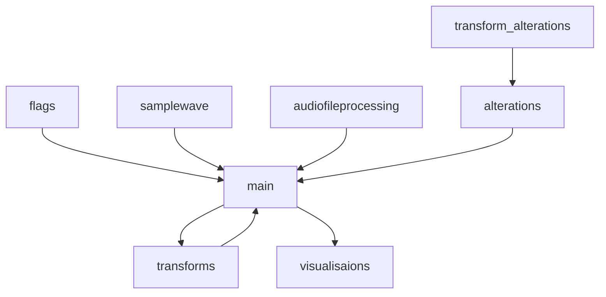

# Implementation

## Structure

Code is divided into files: ```index.py```, ```tremaux.py```, ```wall_follower.py```, ```generate.py```, ```visualize.py```. <br/>
<br/>




### ui elements

1. **flags** <br/>
```flags.py``` contains the ```flags_finder``` function which  is used to fetch and set the flags for the program. <br/>

2. **main** <br/>
```main.py``` is the main file of the program. It is used to call all the other files and functions. <br/>

3. **alterations** <br/>
```alterations.py``` contains the calling functions used to let the user choose how to alter the audio data. <br/>

4. **visualisations** <br/>
```visualisations.py``` contains the functions used to plot the originla audio data, the fourier transform of the original data, the altered fourier transforms and the altered audio data. <br/>

### services elements

1. **samplewave** <br/>
The object ```SampleWave()``` is used to generate a sample sound wave to be used in the program. The class is only called if no audio file is specified. The ```SampleWave()``` class has the following methods:
- ```sample_wave_generation()``` function generates a random wave of random ampletude and frequency between 0 and 256 hz. 
- ```generate_noise()``` function adds noise to the generated wave. 
- ```get_audio_data()``` function is used to get the audio data from the generated wave. 
- ```get_sample_rate()``` function is used to get the sample rate of the generated wave. 
- ```set_audio_data()``` function is used to set the audio data from the generated wave. 
- ```output()``` function is used to output the generated wave to a .wav file. (it is called by main after the samplewave object )

2. **audio_file_wave**
The object ```AudioWave()``` is used to process a given audio file. It will be used insteead of the smaple wave class in the event that an audio file is spcifed. The ```AudioWave()``` class has the following methods:
- ```read_data()``` function reads the data from a .wav file audio file and returns the data as a numpy array.
- ```data_triming()``` function trims the data to get rid of leading and trailing silence.
- ```get_audio_data()``` function is used to get the audio data from the generated wave.
- ```get_sample_rate()``` function is used to get the sample rate of the generated wave.
- ```set_audio_data()``` function is used to set the audio data from the altered wave and re-add the leading and treailing zeros.
- ```output()``` function is used to output the generated wave to a .wav file. (it is called by main after the samplewave object )

3. **transform_alterations** <br/>
```transform_alterations.py``` contains the functions used to alter the audio data. 
The functions are as follows:
- ```high_pitch_reduction()``` function is used to get rid of high pitch noise in the audio data to a given frequency.
- ```low_pitch_reduction()``` function is used to get rid of low pitch noise in the audio data to a given frequency.
- ```noise_reduction()``` function is used to get rid of noise in the audio data to a given threashold. The threashold dictates what persent of the highest intensity frequency to set the cutoff point at (eg. if threashold is set at 50, all frequencies below 50% of the highest intensity frequency will be set to 0).

4. **transforms** <br/>
```transforms.py``` contains the functions used to transform the audio data.
The functions are as follows:
- ```run_transform()``` this function is used to run the correct fourier transform on the audio data.
- ```run_inverse()``` this function is used to run the correct inverse fourier transform on the audio data.
- ```discrete_fourier_transform()``` this function performs a discrete fourier transform on the audio data.
- ```fast_fourier_transform()``` this function performs a fast fourier transform on the audio data.
- ```bluestein_fft()``` this function performs a bluestein fast fourier transform on the audio data. Bluestines fft is a fast fourier transform that uses zeor padding to allow for non power of 2 sample sizes.
- ```inverse_discrete_fourier_transform()``` this function performs a inverse discrete fourier transform on the audio data.
- ```inverse_fast_fourier_transform()``` this function performs a inverse fast fourier transform on the audio data.

example output of the program:
in this example, we perform a noise reduction on the starwars3.wav file. Here, the threashold is set to 50% of the highest intensity frequency. The original audio data is plotted on top, the original and altered fourier transforms are plotted in the middle and the altered audio data is plotted on the bottom. 


## Performance
The following graphs show the time taken by each algorithm to perform a fourier transform on a sample wave of differeing sample sizes.

<p align="center">


</p>
from the graph titled ```performance Test for: rft, Bluestines_fft, irft,ifft``` we can see that the rft and its inverse quickly gain long running times as the sample size increases. This is due to the fact that the rft is an O(n^2) algorithm. While the bluestines fft and its inverse are both O(nlogn) algorithms and so they have much better performance. 

from the graph titled ```bluestines_fft vs fft``` we can see that the bluestines fft and the fft have very similar performance however the fft only funcitons when the sound wavee is of length 2^n. Here, we can also clearly see that as the sample size goes past a power of 2, the time complexity of bluestines fft increases. This is due to the fact that bluestines fft uses zero padding to which increases the data length to the closest upper power of 2.

other noteble results are as follows:
- the ifft takes slightly shorter then the blue stines fft to run. This is due to the fact that the ifft does not have to zeropad the data again as it did with bluestines fft.
- most of the spikes in the dat are due to my laptop running other programs in the background. 

## Possible improvements
There is still quite a few improvements that I would like to make to the program. These include:
1. adding the ability to use different audio file formats.
2. adding the ability to use increased length audio files.
3. adding the ability to use different audio channels.
4. adding more audio altering functions.


## Sources
